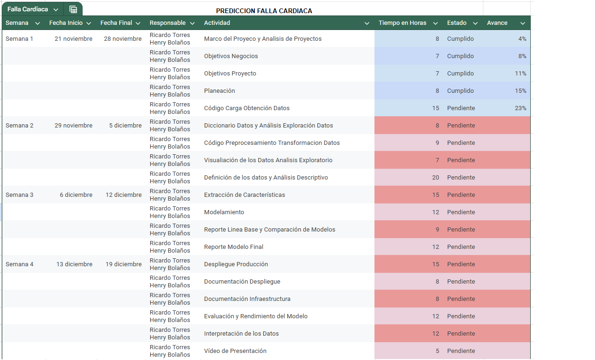

# Project Charter - Entendimiento del Negocio

## Nombre del Proyecto

Predicción Insuficiencia Cardiaca Utilizando Técnicas de Machine Learning

## Objetivo del Proyecto

### Objetivo General:
Desarrollar un modelo predictivo basado en técnicas de machine learning para identificar tempranamente el riesgo de insuficiencia cardíaca en pacientes, mediante el análisis de factores de riesgo, contribuyendo así a la prevención y diagnóstico temprano de la enfermedad.

### Objetivos Específicos:
- Identificar y analizar los principales factores de riesgo asociados con la insuficiencia cardíaca
- Determinar las correlaciones y patrones entre los diferentes factores de riesgo y el desarrollo de la enfermedad
- Desarrollar un sistema de clasificación que combine múltiples modelos de machine learning para predecir el riesgo de insuficiencia cardíaca
- Optimizar el rendimiento del modelo para lograr un equilibrio entre sensibilidad y especificidad en la detección de casos de riesgo
- Implementar técnicas de interpretabilidad para explicar las predicciones del modelo de manera comprensible para el personal médico
- Crear una herramienta de screening que ayude a los profesionales de la salud en la identificación temprana de pacientes en riesgo
- Contribuir a la reducción de la mortalidad por enfermedades cardiovasculares mediante la detección temprana
- Optimizar la asignación de recursos médicos priorizando la atención en pacientes con mayor riesgo

## Planteamiento del Problema
La insuficiencia cardíaca es una afección crónica y grave que se desarrolla con el tiempo. A medida que la capacidad de bombeo del corazón se debilita, resulta más difícil llenar y bombear sangre adecuadamente. Esto provoca diversos síntomas y puede afectar tanto el lado derecho, el lado izquierdo, o ambos lados del corazón.

- **Referencias**:
  - American Heart Association: [What is Heart Failure](https://www.heart.org/-/media/files/health-topics/answers-by-heart/answers-by-heart-spanish/what-is-heartfailure_span.pdf)
  - National Institute on Aging: [Insuficiencia Cardíaca](https://www.nia.nih.gov/espanol/corazon/insuficiencia-cardiaca#:~:text=La%20insuficiencia%20card%C3%ADaca%20es%20una,satisfacer%20las%20necesidades%20del%20cuerpo)

### Datos Clave
- Las enfermedades cardiovasculares son la principal causa de muerte a nivel mundial.
- Las muertes relacionadas con cardiopatías y accidentes cerebrovasculares afectan desproporcionadamente a países de ingresos medianos y bajos.
- Factores como una alimentación poco saludable, inactividad física, y tabaquismo aumentan el riesgo de enfermedades cardiovasculares.

- **Referencias**:
  - Organización Panamericana de la Salud: [Enfermedades Cardiovasculares](https://www.paho.org/es/temas/enfermedades-cardiovasculares)
  - Organización Mundial de la Salud: [Enfermedades Cardiovasculares](https://www.who.int/es/news-room/fact-sheets/detail/cardiovascular-diseases-(cvds))

### Síntomas
- Dolor de pecho (angina de pecho)
- Falta de aire
- Dolor o entumecimiento en las extremidades
- Dolor en el cuello, mandíbula, garganta, abdomen superior o espalda

- **Referencias**:
  - Organización Panamericana de la Salud: [Síntomas de Enfermedades Cardiovasculares](https://www.paho.org/es/temas/enfermedades-cardiovasculares)
  - Organización Mundial de la Salud: [Síntomas de Enfermedades Cardiovasculares](https://www.who.int/es/news-room/fact-sheets/detail/cardiovascular-diseases-(cvds))

### Factores de Riesgo
- **Demográficos**: Edad, sexo, antecedentes familiares
- **Estilo de Vida**: Tabaquismo, alimentación, actividad física, consumo de alcohol
- **Condiciones Médicas**: Hipertensión, diabetes, hiperlipidemia, obesidad
- **Ambientales**: Contaminación atmosférica

- **Referencias**:
  - Organización Panamericana de la Salud: [Factores de Riesgo de Enfermedades Cardiovasculares](https://www.paho.org/es/temas/enfermedades-cardiovasculares)
  - Organización Mundial de la Salud: [Factores de Riesgo de Enfermedades Cardiovasculares](https://www.who.int/es/news-room/fact-sheets/detail/cardiovascular-diseases-(cvds))

### Diagnóstico
El diagnóstico de la insuficiencia cardíaca puede ser difícil, especialmente en las etapas iniciales. Muchos de los síntomas de la insuficiencia cardiaca no son específicos y, por lo tanto, no ayudan a distinguir entre la insuficiencia cardiaca y otros problemas. Los síntomas más específicos (ortopnea y disnea paroxística nocturna) son menos comunes, especialmente en pacientes con síntomas más leves, por lo que no son sensibles. Los síntomas y signos pueden ser especialmente difíciles de identificar e interpretar en obesos, persona mayor y paciente con EPOC

- **Referencias**: 
  - scielo: [Factores que inciden en la insuficiencia cardíaca en pacientes de edades adultas](https://homolog-ve.scielo.org/scielo.php?script=sci_arttext&pid=S1316-48212023000200108)

### Prevención
Las enfermedades cardiovasculares son la principal causa de defunción en el mundo. Según las estimaciones, se cobran cada año 17,9 millones de vidas. Para prevenir las defunciones prematuras es preciso conocer cuáles son las personas que corren más riesgo cardiovascular y velar por que reciban el tratamiento adecuado. Además, el acceso a medicamentos esenciales y tecnologías básicas de salud que permitan tratar las enfermedades no transmisibles en todos los centros de atención primaria es esencial para proporcionar tratamiento y asesoramiento a toda persona que lo necesite.

- **Referencias**: 
  - Organización Mundial de la Salud: [Enfermedades cardiovasculares] (https://www.who.int/es/health-topics/cardiovascular-diseases#tab=tab_1)

## Justificación del Uso de Machine Learning
1. **Complejidad del Diagnóstico Temprano**: Los síntomas no específicos dificultan el diagnóstico temprano.
2. **Impacto en la Salud Pública**: Principales causantes de muerte a nivel mundial, afectando especialmente a países de ingresos medianos y bajos.
3. **Múltiples Factores de Riesgo Interrelacionados**: Machine learning puede analizar múltiples factores simultáneamente para identificar patrones complejos.
4. **Necesidad de Prevención**: Identificación temprana de personas en riesgo para proporcionar tratamiento adecuado.

El uso de Machine learning se justifica porque puede procesar y analizar múltiples variables, detectar relaciones no lineales entre los factores de riesgo, identificar pacientes en riesgo antes de que desarrollen síntomas evidentes, y contribuir a los objetivos de salud pública.

## Modelos de machine learning propuestos
**Modelos de Clasificación Binaria:**
1. **Regresión Logística:**
- Ventajas:
  - Alta interpretabilidad (crucial en contextos médicos)
  - Puede proporcionar probabilidades de riesgo
  - Útil para identificar la importancia relativa de cada factor de riesgo
- Uso: Modelo base para evaluar el riesgo inicial de insuficiencia cardíaca

2. **Random Forest:**
- Ventajas:
  - Maneja bien datos no lineales y correlacionados
  - Puede trabajar con los múltiples factores de riesgo mencionados
  - Proporciona importancia de características
  - Robusto ante valores atípicos
- Uso: Identificar interacciones complejas entre factores como edad, estilo de vida y condiciones médicas

3. **XGBoost/LightGBM:**
- Ventajas:
  - Alto rendimiento en datos estructurados
  - Maneja bien datos desbalanceados (común en diagnósticos médicos)
  - Puede capturar patrones sutiles en los factores de riesgo
- Uso: Modelo principal para predicción debido a su precisión y capacidad de manejo de datos complejos

**Redes Neuronales:**

1. **Perceptrón Multicapa (MLP):**
- Ventajas:
  - Puede capturar relaciones muy complejas
  - Útil para integrar diferentes tipos de datos
  - Puede procesar tanto variables continuas como categóricas
- Uso: Especialmente útil si se integran datos de diferentes fuentes (historial médico, datos de sensores, etc.)

## Alcance del Proyecto

### Incluye:

#### Descripción de los datos disponibles
1. Datos demográficos:
  - Edad
  - Sexo
2. Datos clínicos:
  - Anemia. Disminución de glóbulos rojos o hemoglobina (booleano)
  - Creatinina_fosfoquinasa. Nivel de la enzima CPK en la sangre (mcg/L)
  - Diabetes. Si el paciente tiene diabetes (booleano)
  - Fracción_de_eyección. Porcentaje de sangre que sale del corazón en cada contracción (porcentaje)
  - Hipertensión. Si el paciente tiene hipertensión (booleano)
  - Plaquetas. Plaquetas en la sangre (kiloplaquetas/mL)
  - Creatinina sérica. Nivel de creatinina sérica en la sangre (mg/dL)
  - Sodio sérico. Nivel de sodio sérico en la sangre (mEq/L)

#### Descripción de los resultados esperados
a) Modelo predictivo:
  - Sistema de clasificación de riesgo de insuficiencia cardíaca
  - Puntuación de riesgo para cada paciente
  - Identificación de factores de riesgo más relevantes
  - Intervalos de confianza para las predicciones

b) Documentación técnica:
  - Manual de implementación del modelo
  - Documentación del código
  - Guía de interpretación de resultados
  - Reporte de validación y pruebas

c) Herramientas de visualización:
  - Dashboard para monitoreo de predicciones
  - Gráficos de importancia de variables
  - Visualización de tendencias y patrones

#### Criterios de éxito del proyecto
a) Métricas técnicas:
  - Sensibilidad > 80% (detección de casos positivos)
  - Especificidad > 75% (identificación correcta de casos negativos)
  - Área bajo la curva ROC > 0.85
  - Valor predictivo positivo > 70%

b) Métricas de implementación:
  - Tiempo de procesamiento < 5 segundos por predicción
  - Tasa de error en producción < 1%
  - Disponibilidad del sistema > 99%

c) Métricas de impacto:
  - Reducción del tiempo de diagnóstico
  - Mejora en la identificación temprana de casos de riesgo
  - Satisfacción del personal médico con la herramienta

### Excluye:
a) Desarrollo de hardware:
  - No incluye desarrollo de dispositivos médicos
  - No incluye integración con equipos de monitoreo cardíaco
  - No incluye desarrollo de sensores o dispositivos de medición

b) Aspectos médicos:
  - No reemplaza el diagnóstico médico profesional
  - No genera planes de tratamiento
  - No proporciona recomendaciones médicas específicas
  - No incluye seguimiento de pacientes
  - No realiza ajustes de medicación

c) Aspectos técnicos:
  - No incluye desarrollo de aplicaciones móviles
  - No incluye integración con sistemas de historias clínicas existentes
  - No incluye procesamiento de imágenes médicas
  - No incluye análisis de señales ECG
  - No incluye procesamiento de datos en tiempo real

d) Aspectos administrativos:
  - No incluye gestión de citas médicas
  - No incluye gestión de inventario de medicamentos
  - No incluye facturación o aspectos financieros
  - No incluye gestión de recursos hospitalarios

e) Ámbito geográfico:
  - No incluye adaptación a regulaciones internacionales
  - No incluye localización para múltiples idiomas
  - No incluye consideraciones específicas de diferentes sistemas de salud

## Metodología

CRISP-DM (Cross-Industry Standard Process for Data Mining) es una metodología para el desarrollo de proyectos de aprendizaje automático. Fue diseñada para ser flexible y aplicable a una amplia variedad de industrias y tipos de proyectos. Su estructura es iterativa y permite una aproximación estructurada a la solución de problemas de análisis de datos.

La metodología CRISP-DM consta de seis fases principales, que proporcionan un marco para el desarrollo de proyectos de aprendizaje automático. Estas fases no son necesariamente lineales, sino que pueden solaparse o repetirse, ya que el proceso de minería de datos es muy interactivo. Las fases son:
- Comprensión del negocio
  - Objetivo: Comprender el problema clínico de la insuficiencia cardíaca (IC) y definir los objetivos del modelo.
  - Acciones: Definir la pregunta clínica que el modelo debe responder.
  - Identificar las variables relevantes para la insuficiencia cardíaca.
- Comprensión de los datos
  - Objetivo: Obtener y explorar los datos disponibles para el modelado.
  - Acciones: Recolectar datos clínicos de pacientes con insuficiencia cardíaca.
  - Explorar los datos: Identificar la calidad de los datos, detectar valores faltantes, distribuciones de variables, y buscar correlaciones o patrones en las variables.
  - Realizar análisis preliminares como análisis estadísticos, histogramas, y diagramas de dispersión para comprender las relaciones entre las variables. 
- Preparación de los datos
  - Objetivo: Limpiar y transformar los datos para que sean adecuados para el modelado.
  - Acciones: Limpiar los datos.
  - Transformar las variables: Normalizar o estandarizar los datos.
  - Crear nuevas características o variables a partir de las existentes y dividir los datos en conjuntos de entrenamiento y prueba. 
- Modelado
  - Objetivo: Seleccionar y aplicar modelos predictivos para predecir insuficiencia cardíaca.
  - Acciones: Seleccionar los algoritmos más apropiados para el problema (regresión logística, árboles de decisión, bosques aleatorios, redes neuronales).
  - Entrenar los modelos utilizando los datos de entrenamiento.
  - Evaluar el rendimiento de cada modelo utilizando métricas como precisión, recall, F1-score, AUC-ROC o error cuadrático medio.
  - Ajustar los hiperparámetros del modelo para mejorar su rendimiento.
- Evaluación
  - Objetivo: Evaluar el rendimiento del modelo y verificar que cumpla con los objetivos del negocio.
  - Acciones: Evaluar el modelo con el conjunto de datos de prueba para comprobar su capacidad de generalización.
  - Validar que el modelo predice correctamente el riesgo de insuficiencia cardíaca.
  - Realizar pruebas de validación cruzada para garantizar que el modelo es robusto y no está sobreajustado a los datos de entrenamiento.
  - Comparar los resultados del modelo con las expectativas del negocio y los resultados clínicos. 
- Despliegue
  - Objetivo: Implementar el modelo en un entorno real para tomar decisiones clínicas.
  - Acciones: Crear una interfaz para que los usuarios puedan ingresar nuevos datos de pacientes y obtener predicciones sobre el riesgo de insuficiencia cardíaca. 
  - Monitorizar el rendimiento del modelo una vez desplegado, y realizar ajustes o recalibraciones si es necesario.
  
## Cronograma

## Seguimiento y Avances

Reuniones de semana 1 
En la semana 1 tuvimos dos reuniones que correspondieron a integración del equipo de trabajo y a definir el problema a trabajar.

Reuniones de semana 2
En la semana 2 tuvimos cuatro reuniones que correspondieron a generación de entendimiento de negocio, generación de extracción de los datos, ajustar cronograma ajustar documento y realizar entrega del primer hito.

## Equipo del Proyecto

- Henry Hernán Bolaños Bravo
- Wilson Ricardo Torres Morales

## Aprobaciones

- Oscar Alberto Bustos Brinez
- 28 Noviembre 2024
  
